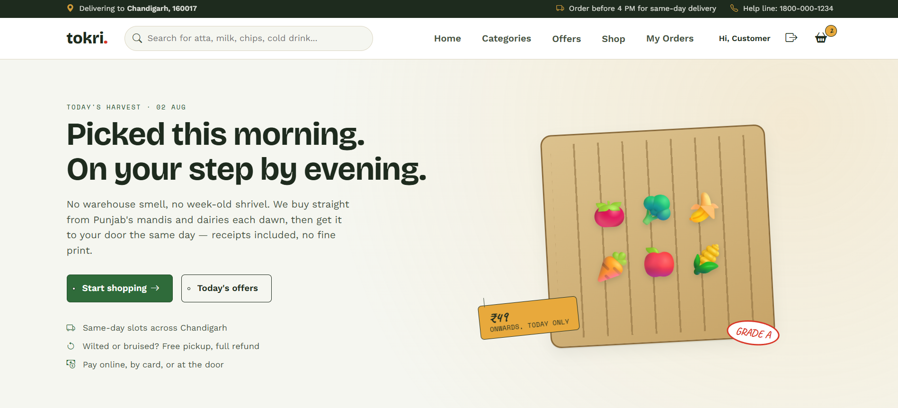
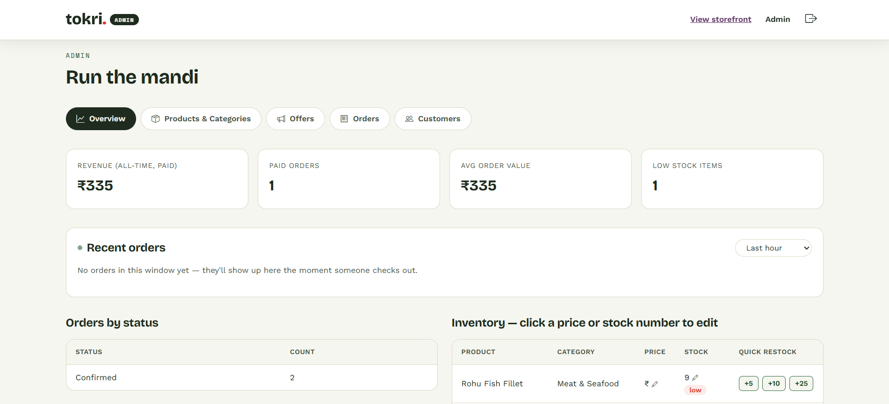
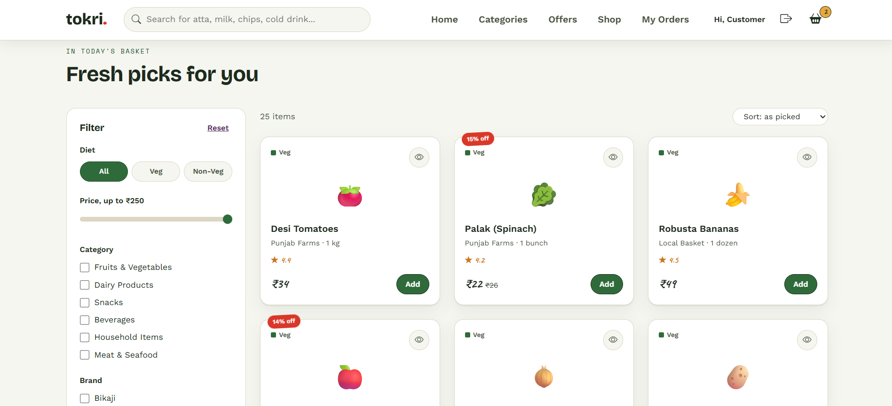
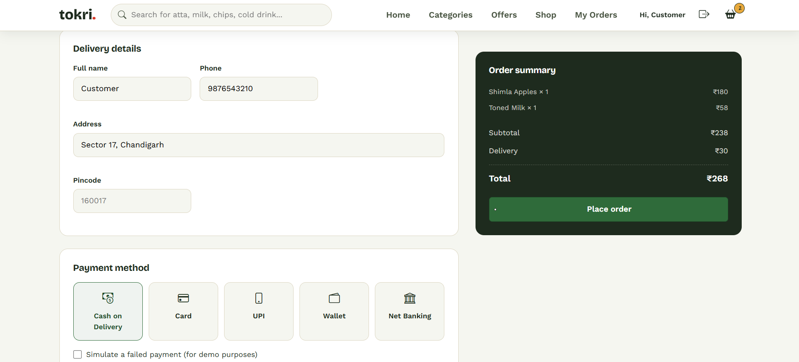

# Tokri. — Online Grocery Delivery System

A full-stack grocery delivery application built with React, Node.js/Express, and MongoDB. The interface is inspired by traditional Indian mandi markets, using a produce-themed colour palette, hanging price-tag elements, and chalkboard-style offer banners to create a distinct shopping experience..

*Developed as part of an MCA coursework project — see [docs/architecture.md](docs/architecture.md) for
the full ER diagram, DFDs, and system design documentation.*

## Screenshots

**Homepage**
 

**Admin Dashboard**
 

**Product Filtering**
 

**Checkout**
 

## Features

**Customer**
- Browse, search, and filter products by category, price, brand, and veg/non-veg
- Cart persisted per account (not just in-memory) — add, update, remove items
- Full checkout flow: delivery details → payment method → payment confirmation
- Order history and order tracking (delivery + payment status)

**Admin**
- Product, category, and offer management (CRUD)
- Order management with live status updates
- Sales, inventory, and customer reports
- Recent-orders panel (auto-refreshing) with inline price/stock quick-edit

## Tech stack

| Layer | Tech |
|---|---|
| Frontend | React (Vite), React Router, Bootstrap 5, Axios |
| Backend | Node.js, Express.js |
| Database | MongoDB, Mongoose |
| Auth | JWT + bcrypt |

## Project structure

```
tokri-fullstack/
├── backend/     Express + MongoDB REST API
├── frontend/    React (Vite) client
└── docs/        Architecture docs, ER diagram, DFDs, screenshots
```

## Getting started

### 1. Backend

```bash
cd backend
npm install
cp .env.example .env
```

Edit `.env`:
- `MONGODB_URI` — a local Mongo (`mongodb://127.0.0.1:27017/tokri`) or an
  [Atlas](https://www.mongodb.com/atlas) connection string.
- `JWT_SECRET` — any long random string.

Seed the database (categories, 25 products, 3 offers, two demo accounts) and start the API:

```bash
npm run seed
npm run dev
```

API runs at `http://localhost:5000` — `GET /api/health` should return `{"status":"ok"}`.

### 2. Frontend

In a second terminal:

```bash
cd frontend
npm install
cp .env.example .env
npm run dev
```

Visit `http://localhost:5173`.

## Demo accounts

| Role | Email | Password |
|---|---|---|
| Admin | admin@tokri.in | admin123 |
| Customer | customer@tokri.in | customer123 |

## Highlights

- Dedicated admin dashboard with inventory management and sales reports.
- Inline editing for product price and stock with quick-restock shortcuts.
- Simulated payment failure and retry flow for testing the checkout process.

## Documentation

Full system design — ER diagram, Data Flow Diagrams (Level 0 & 1), and a table mapping
each diagram element to the exact file/function that implements it — is in
[`docs/architecture.md`](docs/architecture.md).

## Notes

- `node_modules/` isn't committed — run `npm install` in both `backend/` and `frontend/`.
- Browsing/searching is public; adding to cart requires login.
- If you hit CORS errors, check `CLIENT_URL` in `backend/.env` matches your frontend's URL.
