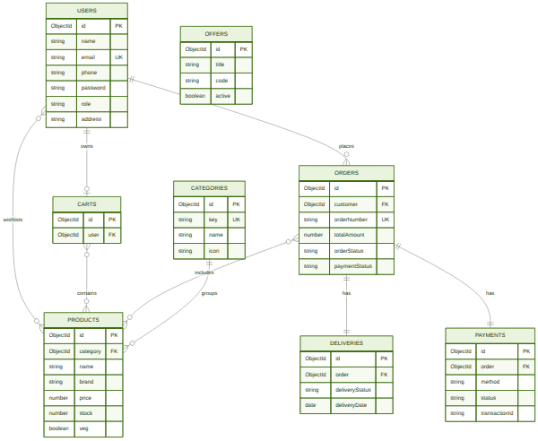
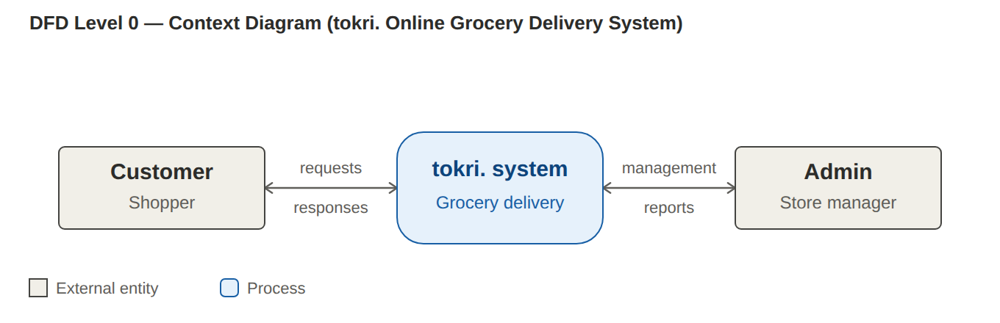
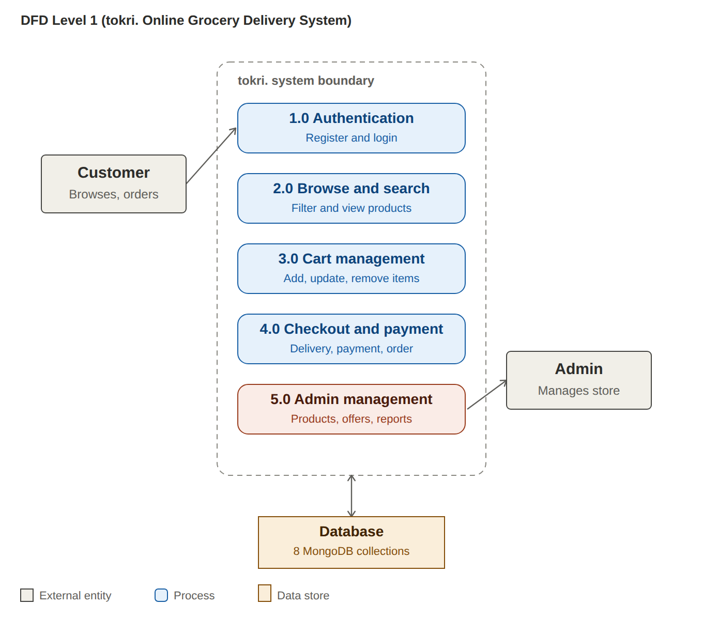

# Architecture & Design Documentation

This document covers the system design behind tokri. — the ER diagram, DFDs, and exactly
where each piece of that design lives in the actual code. It's the detailed companion to
the top-level [README](../README.md).

## ER Diagram

Implemented as Mongoose schemas in `backend/models/`. MongoDB doesn't have foreign keys,
so relationships are implemented as document references (`ObjectId` fields with `ref:`)
instead of SQL joins — a `Product` references its `Category`, an `Order` references its
`Customer` and has its own `Delivery` and `Payment` documents, etc.

## DFD — Level 0 (Context Diagram)

Customer and Admin are the two external entities. In the code, this split is enforced by
route structure: everything under `/api/*` is customer-facing, and admin-only routes are
gated by the `adminOnly` middleware (`backend/middleware/admin.js`).

## DFD — Level 1

## Diagram → code mapping

| Diagram | Where it lives |
|---|---|
| ER Diagram entities | `backend/models/` — one file per entity (User, Product, Category, Order, Delivery, Payment). |
| DFD Level 0 (Customer/Admin ↔ System) | Route split: `/api/*` for customer flows, admin routes gated by `adminOnly` middleware. |
| DFD L1, process 1.0 (Browse/Search) | `GET /api/products` with query filters, plus client-side filtering in `ShopContext.jsx` for instant results. |
| DFD L1, process 2.0 (Manage Products/Categories) | `productController.js` + `categoryController.js`, admin CRUD routes. |
| DFD L1, process 3.0 (Cart) | `cartController.js` — add/update/remove/view. |
| DFD L1, process 4.0 (Checkout) | `orderController.checkout()` — delivery details → payment method → process payment → place order. |
| DFD L1, process 5.0 (Payment Processing) | `orderController.js`'s `callPaymentGateway()` / `attemptPayment()` — simulates a gateway (no real payment processor), including the "Payment Failed → Try Again" branch (`POST /api/orders/:id/retry-payment`). |
| Admin reports | `GET /api/admin/reports/sales`, `/reports/inventory`, `/customers`, `/reports/recent-orders`. |

## Backend Architecture

The backend follows a layered architecture:

- **Routes** receive API requests and define endpoints.
- **Controllers** implement the application logic.
- **Models** define MongoDB collections using Mongoose schemas.
- **Middleware** handles authentication and authorization.
- **Utilities** contain reusable helper functions.

This separation keeps the code modular and easier to maintain.